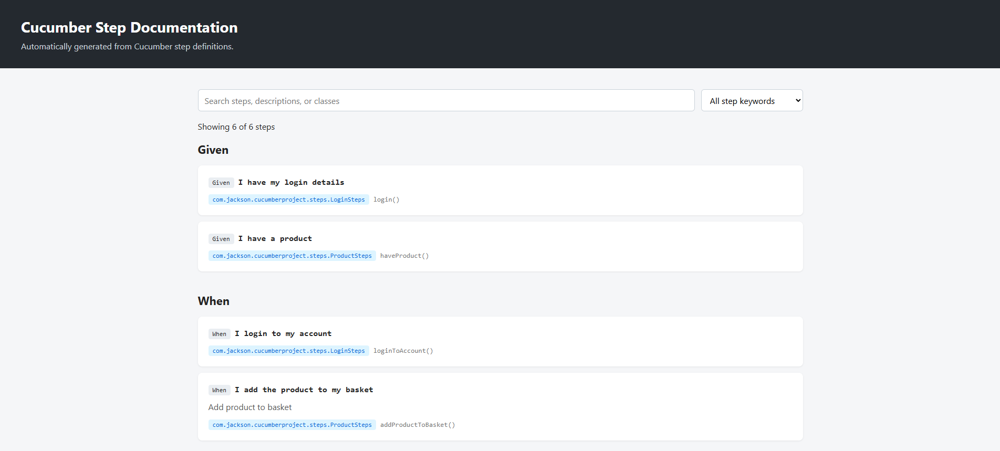

# Cucumber Step Documentation Generator

**Turn your Cucumber step definitions into searchable, tester-friendly documentation.**

[](https://openjdk.org/)
[](https://maven.apache.org/)
[](https://cucumber.io/)
[](LICENSE)

The Maven plugin scans compiled Cucumber step definitions and writes a standalone HTML reference. Testers can search expressions, descriptions, classes, and methods, then filter by `Given`, `When`, `Then`, `And`, or `But`.



## What you get

- A single HTML file that can be opened locally or shared with your team.
- Searchable step expressions and descriptions.
- Filters for Cucumber step keywords.
- The step definition class and method shown with each step.
- Optional human-written descriptions with `@StepDescription`.

## Modules

| Module | Purpose |
| --- | --- |
| `cucumber-steps-docs-core` | Step model, version-neutral annotation scanner, and `@StepDescription` |
| `cucumber-steps-docs-plugin` | Maven goal that generates the HTML documentation |

## Quick start

Build and install the snapshot artifacts locally:

```bash
mvn install
```

Add the core module to the consuming project so its step definitions can compile with `@StepDescription`:

```xml
<dependency>
    <groupId>io.github.dann634</groupId>
    <artifactId>cucumber-steps-docs-core</artifactId>
    <version>1.0.4</version>
</dependency>
```

Configure the Maven plugin in that project. It runs during `process-test-classes` and writes the report to the consuming project's `target` directory by default.

```xml
<build>
    <plugins>
        <plugin>
            <groupId>io.github.dann634</groupId>
            <artifactId>cucumber-steps-docs-plugin</artifactId>
            <version>1.0.4</version>
            <executions>
                <execution>
                    <goals>
                        <goal>generate</goal>
                    </goals>
                </execution>
            </executions>
        </plugin>
    </plugins>
</build>
```

Run the lifecycle through `process-test-classes` (or a later phase):

```bash
mvn test
```

The generated report is `target/cucumber-step-documentation.html`.

## Add descriptions to steps

Import the annotation and add it to a Cucumber step method. The description appears beneath the expression in the generated report.

```java
import com.jackson.cucumberdocs.StepDescription;
import io.cucumber.java.en.Given;

@Given("a customer exists")
@StepDescription("Creates a customer that can be used by the scenario")
public void aCustomerExists() {
    // Set up the customer
}
```

Descriptions are optional. The plugin reads them from the consuming project's test classpath when generating the report.

## Configuration

The plugin supports these properties:

| Property | Default | Purpose |
| --- | --- | --- |
| `cucumber.step.docs.skip` | `false` | Skip report generation |
| `cucumber.step.docs.failOnError` | `true` | Fail the Maven build if generation fails |

To change the output path, configure the plugin's `outputFile` parameter:

```xml
<configuration>
    <outputFile>${project.build.directory}/reports/steps.html</outputFile>
</configuration>
```

## Requirements

- Maven must run on JDK 17 or newer.
- Cucumber Java step definitions must be on the project's test classpath. Cucumber 7 and 8 are supported.
- The consuming project can target an older Java release if Maven runs on JDK 17+ and that project's Cucumber version supports the target runtime.

The scanner inspects compiled main and test classes, plus dependency JARs on the test classpath. It reads bytecode annotations directly, so it does not need to load or control the consuming project's Cucumber version.

## License

This project is licensed under the [MIT License](LICENSE).
